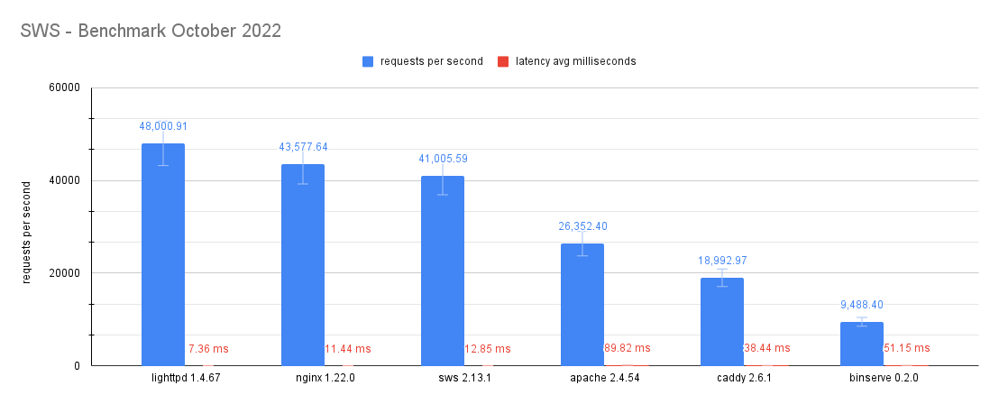

# SWS - Benchmarks 2022

> A benchmark suite which measures the requests per second and latency on average for several web servers.



## Motivation and context

We wanted to prepare some benchmarks to have a general idea about the SWS performance path over time as well as an excuse to improve/optimize SWS in that regard.

**Disclaimer:** Note that this is a rough reference about some particular performance aspects (requests per second and latency on average) so take them at your own risk.

## Web servers setup

- **lighttpd** `1.4.67` (default config)
- **nginx** `1.22.0` (default config + worker_processes=4, access_log=off)
- **sws** `2.13.1` (default config)
- **apache** `2.4.54` (default config)
- **caddy** `2.6.1`  (default config)
- **binserve** `0.2.0` (default config + fast_mem_cache=false, enable_hot_reload=false, enable_logging=false, enable_directory_listing=false)

## How to measure

Change `WRK_URL` env with the corresponding server URL to export the [wrk](https://github.com/wg/wrk) metrics.

```sh
WRK_URL="http://localhost" make wrk
# wrk -c 500 -t 12 -d 10s --latency http://localhost
```

After that, wrk will save two files (JSON/CSV) on disk with the resulting metrics. 

## Data used

The data used can be found in [sws_benchmarks.csv](sws_benchmarks.csv).

## System used

- **OS:** Arch Linux
- **Kernel:** 5.19.13-arch1-1 (64 bits)
- **Processor:** 4 × Intel® Core™ i7-6500U
- **RAM:** 8 GiB
